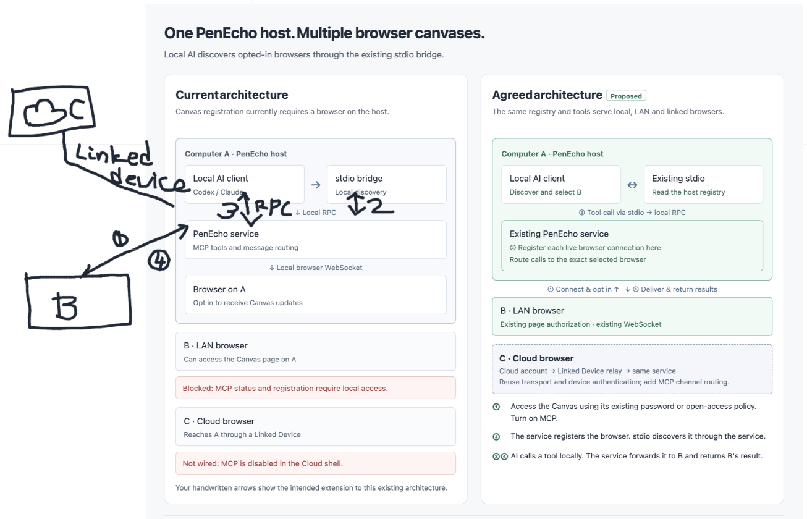
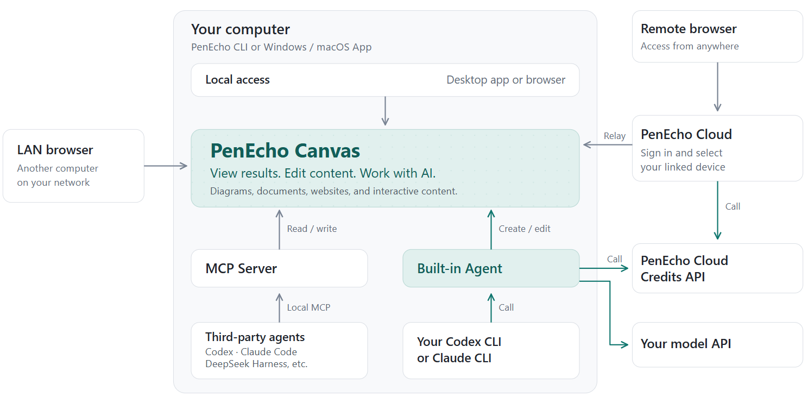

<h1 align="center">
  
</h1>

<p align="center">
  <a href="../../README.md">English</a> |
  <strong>简体中文</strong> |
  <a href="README.ja.md">日本語</a> |
  <a href="README.ko.md">한국어</a> |
  <a href="README.ru.md">Русский</a> |
  <a href="README.es.md">Español</a> |
  <a href="README.pt-BR.md">Português (Brasil)</a> |
  <a href="README.fr.md">Français</a> |
  <a href="README.de.md">Deutsch</a>
</p>

<h1 align="center">A spatial workspace<br>for thinking with AI.</h1>
<p align="center">手写、探索、创作，让内置 Agent 或你自己的 MCP 助手加入同一块画布。</p>
<p align="center">
  
  <a href="../../LICENSE"></a>
</p>
<p align="center">
  <a href="https://penecho.ai">官网</a> ·
  <a href="https://github.com/penecho/penecho/releases/latest">下载</a> ·
  <a href="#快速开始">快速开始</a> ·
  <a href="../mcp-setup.md">MCP 指南</a> ·
  <a href="https://discord.gg/3jrPJ3mXdX">Discord</a>
</p>

<p align="center">
  
  
</p>

<p align="center">
  
  
</p>

<p align="center">
  <a href="https://www.kimi.com/code?aff=penecho">
    <picture>
      <source media="(prefers-color-scheme: dark)" srcset="../assets/kimi-open-source-friends-dark.svg">
      
    </picture>
  </a>
</p>

## 让 AI 对话在空间中展开

继续使用你熟悉的 **Codex、Claude、Kimi 或其他 AI Agent**，让 PenEcho 为对话中的成果提供一个工作空间。

通过 MCP，让 AI 把解释变成图解，把方案变成可操作的预览。资料、推理和作品并排展开；你在画布上的圈画、批注与反馈，可以被 AI 客户端读取，接着推进下一轮修改。

| 继续熟悉的对话 | 看见成果逐步成形 | 让反馈回到对话 |
| --- | --- | --- |
| 使用你已有的 AI Agent 讨论问题、推进任务。 | 通过 PenEcho MCP 服务，把图解、文档和交互预览放到画布上。 | 试用结果、圈画批注，让 Agent 读取反馈并继续修改。 |

<p align="center">
  <a href="../assets/mcp-spatial-example.png">
    
  </a>
</p>
<p align="center"><em>在画布上讨论架构，并用手写标注提出反馈。</em></p>

**在完成之前，先看到它的样子。** 在与 AI 的交互中，看见项目逐步成形。先试一试，再给出反馈，一起把项目向前推进。

[通过 MCP 接入你的 Agent →](#通过-mcp-接入你的-agent)

## 你可以做什么

- **用画布思考。** 在同一空间组合手写内容、公式、文字、图片、图表和交互式 HTML Widget。
- **与 AI 创作。** 让内置 Agent 结合文件、网络研究和画布上下文，分析问题并生成可编辑的可视化结果。
- **接入自己的 Agent。** 通过 MCP，让 Codex、Claude Code 或其他兼容客户端读写你明确开放的 Canvas。
- **保存与分享。** 用项目组织画布，保存云端版本、同步收藏，通过 Echoes 发布作品。

## 1.3.0 新内容

| 更新 | 带来的能力 |
| --- | --- |
| **MCP 工作空间** | 画布发现、截图、对象编辑、交互 Widget、虚拟源文件和用户反馈；支持明确开放的本机、局域网和关联设备云端浏览器。 |
| **PenEcho Cloud Credits API** | 使用账号积分调用 PenEcho 托管模型，也可继续使用自己的 API 或 CLI；设置中可查看可用模型、费率和余额。 |
| **连接管理** | 保存多个 AI 连接，为不同客户端选择各自的活动连接。 |
| **画布与工作台** | 更流畅的绘写和导航、更简洁的 Studio 控件、自适应 Agent 面板与可自定义的快捷键。 |

## 工作原理

<p align="center">
  
</p>

在电脑上运行 PenEcho 桌面应用或本地服务，通过本机、局域网浏览器或 Cloud 关联设备访问 Canvas。内置 Agent 使用你选择的 AI 连接；外部 Agent 通过本地 MCP 桥接操作已开放的画布。

实现细节见[架构文档](../architecture.md)。

## 快速开始

**桌面应用：** 从 [GitHub Releases](https://github.com/penecho/penecho/releases/latest) 下载 Windows 或 macOS 版本。

**npm：** 需要 Node.js **22.19 或更新版本**。

```bash
npm install -g penecho
penecho
```

打开 `http://localhost:3888`。在**设置 → 连接**中添加自己的模型 API，或已安装并登录的 Codex、Claude Code、Kimi CLI。连接保存在 `~/.penecho/connections.json`，通用设置保存在 `~/.penecho/config.env`。使用 PenEcho 托管模型时，登录账号并在设置中选择可用模型。

启动时设置六位访问码，或明确选择在可信网络开放访问。终端也会显示供其他设备使用的局域网地址。

<details>
<summary>从源码运行</summary>

```bash
git clone https://github.com/penecho/penecho.git
cd penecho
npm install
npm start
```

</details>

## 通过 MCP 接入你的 Agent

1. 启动 PenEcho，在 **设置 → MCP 服务** 中开放当前 Canvas。
2. 在设置中配置受支持的本机客户端，或复制生成的启动配置。全局 npm 安装可在接受 `mcpServers` JSON 的客户端中使用：

   ```json
   {
     "mcpServers": {
       "penecho": { "command": "penecho", "args": ["mcp"] }
     }
   }
   ```

3. 告诉 Agent：**“把刚才讨论的架构展示到我的 PenEcho 画布上。”**

Agent 可以查看相关内容、编辑对象、创建可视化结果、修改文档源文件，并接收你的反馈。只有已开放且连接中的 Canvas 才会被发现。MCP 客户端运行在 PenEcho 主机上；局域网和云端浏览器支持不会开放公共 MCP 接口。

桌面应用请使用设置生成的配置，其中包含正确的内置运行时。详见 [MCP 配置指南](../mcp-setup.md)和可选的 [Agent 工作流 skill](../../skills/penecho-mcp/SKILL.md)。

## PenEcho Cloud 与 AI 连接

[PenEcho Cloud](https://penecho.ai) 提供私有项目与版本保存、收藏同步、Echoes 公开分享，以及关联电脑的远程访问。

| 连接方式 | 使用方法 |
| --- | --- |
| **PenEcho 模型** | 登录账号，选择可用托管模型并使用积分；设置中展示当前费率和余额。 |
| **自己的模型 API** | 配置兼容 OpenAI 或 Anthropic 格式的服务地址、模型和 API Key，用量由对应服务商结算。 |
| **自己的 CLI** | 使用本机已安装并登录的 Codex、Claude Code 或 Kimi CLI，可用性与用量取决于对应服务商套餐。 |

在本机使用托管模型只需登录 Cloud，无需关联设备或另填 Credits API Key。远程 MCP 访问需要关联设备在线，且主机与 Cloud 均支持 MCP 中继。

自有 API 和 CLI 连接不消耗 PenEcho 积分。使用自己的连接在本地工作，无需 Cloud 账号。AI 功能需要访问所选服务；本地运行 PenEcho 不代表远程模型可以离线使用。

## 模型与效果

以下为现有实测推荐；响应时间会随服务商、画布复杂度和推理设置变化。表内模型、推理等级及效果描述保留原文。

| Model | Effort | Notes | Recommended use |
| --- | --- | --- | --- |
| Claude Opus 4.8 / 5.0 (`claude-opus-4-8` / `claude-opus-5-0`) | `medium` | Strong quality with a better latency balance | Everyday canvas work |
| Claude Opus 4.8 / 5.0 (`claude-opus-4-8` / `claude-opus-5-0`) | `high` | Higher reasoning quality, longer and more variable waits | Complex handwriting, mathematics, diagrams, or layout |
| Fable 5 (`claude-fable-5` or `fable`) | `medium` | Often around half the response time of `gpt-5.6-sol` at `xhigh` | Fast, high-quality general use |
| [Kimi K3](https://platform.kimi.ai?aff=penecho) (`kimi-k3`) | `medium` | Very good quality; `medium` keeps the balance practical | Recommended Kimi default |
| `gpt-5.6-terra` | `low` to `high` | Surprisingly strong and responsive | Flexible quality and latency targets |
| `gpt-5.6-luna` | `xhigh` | Very good canvas results with strong speed | Quality-first, still responsive |
| `gpt-5.6-sol` | `high` | Good enough for most requests, more responsive than `xhigh` | Default when responsiveness matters |
| `gpt-5.6-sol` | `xhigh` | Very good but slower and more variable | Difficult canvas tasks |
| `deepseek-v4-flash-vision-exp` | `medium` | Good | Vision-capable work through the DeepSeek API |
| `glm-5.3-flash` | `medium` | Good | Fast work through the GLM Anthropic-compatible API |

## 社区与许可

参与贡献请阅读 [CONTRIBUTING.md](../../CONTRIBUTING.md)，提交 PR 前运行 `npm run check`。欢迎在 [Issues](https://github.com/penecho/penecho/issues) 报告问题、在 [Discussions](https://github.com/penecho/penecho/discussions) 交流，或加入 [Discord](https://discord.gg/3jrPJ3mXdX)。

采用 [AGPL-3.0-only](../../LICENSE) 许可，同时提供[商业许可](../../COMMERCIAL-LICENSE.md)。另见[商标政策](../../TRADEMARKS.md)和[贡献者协议](../../CONTRIBUTOR-LICENSE-AGREEMENT.md)。
